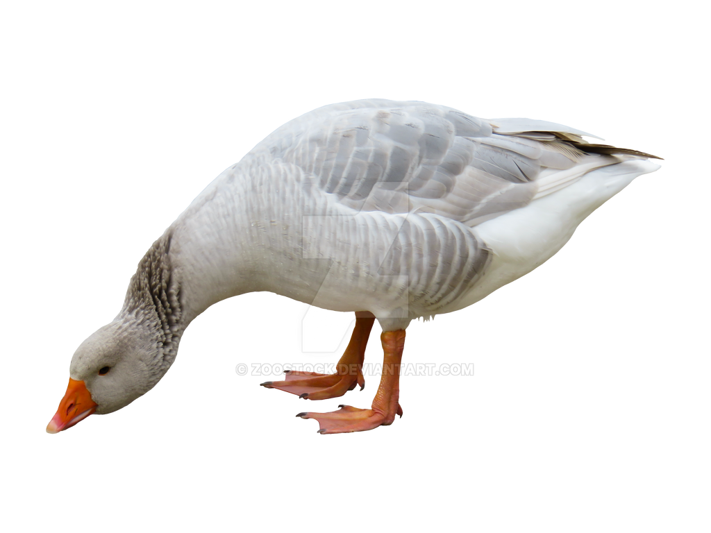

<!DOCTYPE html>
<html lang="en">
<head>
    <meta charset="UTF-8">
    <meta name="viewport" content="width=device-width, initial-scale=1.0">
    <title>Goose Unblocked Games</title>
    
    
</head>
<body onload="updateClocks()">
    

        

        

        

        

    

    
    <h1>Welcome to Goose Unblocked Games</h1>
    
This is a simple HTML page.

    
    <a href="game.html" class="game-link">Play Catch the Goose</a>
</body>
</html>
